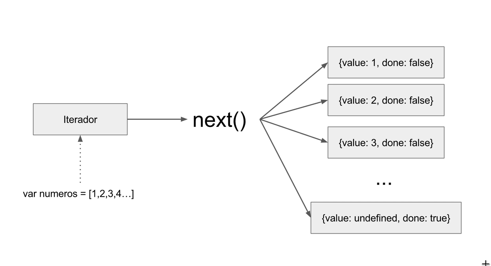

# Entendendo o ECMAScript 6

https://www.udemy.com/entendendo-o-ecmascript-6/learn/v4/content

---

## <a name="indice">Índice</a>

- [Introdução](#parte1)   
- [Ferramentas](#parte2)   
- [Métodos Auxiliares](#parte3)   
- [Iteradores e Iteráveis](#parte4)   
- [For...of](#parte5)   
- [Novas estruturas de dados](#parte6)   
- [Const e Let](#parte7)   
- [Template Strings](#parte8)   
- [Arrow Functions](#parte9)   
- [Melhorias em objetos literais](#parte10)   
- [Valores Padrões](#parte11)   
- [Operadores Rest e Spread](#parte12)   
- [Desestruturamento](#parte13)   
- [Classes](#parte14)   
- [Módulos](#parte15)   
- [Funções Geradoras](#parte16)   
- [Promises](#parte17)   
- [Conclusão](#parte18)   


---

## <a name="parte1">Introdução</a>

- https://medium.com/code-prestige
- https://www.youtube.com/channel/UC-7TVZ9yNWzWA4iRW5umbjw

Os exercícios práticos estão disponíveis no GitHub.:  
- https://github.com/DiegoPinho/entendendo-es6

[Voltar ao Índice](#indice)

---

## <a name="parte2">Ferramentas</a>

ECMAScript x JavaScript

O ECMAScript (ES) é a especificação da linguagem de script que o JavaScript implementa. Isto é, a descrição de uma linguagem de script, sendo padronizado pela Ecma International — associação criada em 1961 dedicada à padronização de sistemas de informação e comunicação — na especificação ECMA-262. 

A especificação é definida pelo ECMA Technical Comittee 39 (TC39), comitê formado por especialistas de grandes companhias da área de tecnologia, tais como: Apple, Google, Microsoft e Mozilla. Este comitê se reúne a cada dois meses, normalmente na Califórnia, para discutir o futuro da especificação. As datas das reuniões, assim como trechos delas, também estão disponíveis online no site oficial. 

O ECMAScript é suportado por uma diversidade de aplicações, principalmente navegadores, em que são implementados pela linguagem JavaScript. Muitas das implementações adicionam extensões específicas a linguagem, como é o caso do JScript da Microsoft. Isso significa que aplicações escritas em uma implementação podem ser incompatíveis com outras. É sempre preciso estar atento a isto.

A partir da versão ES6, será adotado o versionamento por ano e não mais por número. É por isso que em muitos lugares encontramos o ES6 como ECMA2015 ou ES2015. São a mesma coisa. Esta nova atitude se deve ao fato da pretensão de termos uma nova atualização da especificação a cada ano.

Babel

Além do compilador online do Babel, existem outras excelentes ferramentas gratuitas disponíveis na internet que podem ser usadas livremente para acompanhar e testar os códigos que serão apresentados neste cruso. A única exceção é a do capítulo Módulos, pois nele é necessário dividir o código em vários arquivos para ver os efeitos da modularização.

Algumas outras ferramentas gratuitas e online são:

- repl.it
- JS Bin
- ES6 Fiddle
- ES6 Console


Referências:

Site Oficial da ECMA Internacional - http://www.ecmascript.org/index.php
Especificação ES6 - http://www.ecma-international.org/publications/files/ECMA-ST/Ecma-262.pdf
ECMA Compatibility Table - https://kangax.github.io/compat-table/es6/
Repositório do TC39 no GitHub - https://github.com/tc39/ecma262
Site Oficial do Babel - https://babeljs.io/

[Voltar ao Índice](#indice)

---

## <a name="parte3">Métodos Auxiliares</a>

### 1. O método tradicional

```ecmascript 6
<!DOCTYPE html>
<html lang="en">
<head>
    <meta charset="UTF-8">
    <title>ECMAScript 6</title>
</head>
<body>
    <script>
        var frutas = ["abacaxi", "maça", "uva"];
        for(var i = 0; i < frutas.length ; i++){
            console.log(frutas[i]);
        }
    </script>
</body>
</html>
```

O maior problema com esta abordagem é que é impossível saber qual o objetivo do corpo da iteração sem ver sua implementação.

Os métodos auxiliares nos permite iterar um array de forma muito mais clara e simples. Neste capítulo, vimos 5 delas: forEach, map, filter, find, every, some e o reduce. Apesar de terem uma sintaxe muito parecida, cada um tem uma função bem específica. Abaixo, segue um exemplo de como utilizá-las:

#### 2. forEach

```ecmascript 6
var nomes = ['maria', 'josé', 'luciana'];
for(var i = 0; i < nomes.length ; i++){
    console.log(nomes[i]);
}

console.log('------------------');

nomes.forEach(function (nome) {
   console.log(nome);
});

```

Repare no que aconteceu. Dentro do forEach , passamos uma função anônima de retorno, que costumamos chamar de função de callback . Ela é executada para cada elemento dentro da lista. A cada iteração, o valor da lista é atribuído à variável passada como parâmetro no callback — no nosso caso, a variável nome.

Entretanto, note que a função de callback não precisa necessariamente ser anônima. Podemos defini-la antes e atribuí-la a uma variável para passá-la como parâmetro ao forEach :

```ecmascript 6
var nomes = ['maria', 'josé', 'luciana'];
function imprimeNome(nome){
    console.log(nome);
}
nomes.forEach(imprimeNome);

```

Isso acontece exatamente porque os elementos processados pelo forEach são determinados antes da primeira invocação da função de callback . Entretanto, isso não quer dizer que os valores não foram adicionados à lista. Ao adicionar um segundo console.log ao final do código para exibir a lista, notamos que a RedeTV foi adicionada várias vezes ao nosso Array . Uma cópia para cada iteração:

```ecmascript 6
var canais = ['globo','sbt', 'record'];

canais.forEach(function (canal) {
    console.log(canal);
    canais.push('REDE TV'); //este item será ignorado
});
console.log(canais);

```

Utilizamos para quando precisamos passar por todos os nossos itens de um Array. 

Exemplo: exibir todos os seus itens no console.

```ecmascript 6
var numeros = [1,2,3,4,5];
numeros.forEach(function(numero){
    console.log(numero);
});
// saída
// 1
// 2
// 3
// 4
// 5
```


#### 3. map

O método map é muito útil quando precisamos não somente passar por todos os elementos de um Array , mas também modificá-los.

```javascript
var numeros = [1,2,3];
var dobro = [];

numeros.forEach(function (numero) {
    dobro.push(numero * 2);
});

console.log(dobro);
```

```ecmascript 6
var numeros = [1,2,3];

var dobro = numeros.map(function (numero) {
    return numero * 2;
});

console.log(dobro);
console.log(numeros);

```

O map executa a função de callback recebida por parâmetro para cada elemento iterado de numeros e constrói um novo Array com base nos retornos de cada uma das chamadas. Como o map nos devolve uma outra instância de Array , a lista original nunca é realmente modificada, o que mantém sua integridade.


#### 4. filter

Como o próprio nome já pode induzir, este método é deve ser utilizado quando temos a necessidade de filtrar nossa lista de acordo com algum critério.

```ecmascript 6
var alunos = [
    {nome:'José', idade:15},
    {nome:'Maria', idade:3},
    {nome:'luciana', idade:44},
    {nome:'lucimara', idade:22}
];

var alunosDeMaior = [];
for(var i = 0; i < alunos.length; i++){
    var aluno = alunos[i];
    if(aluno.idade >= 18){
        alunosDeMaior.push(aluno);
    }
}
console.log(alunosDeMaior);
```

A função de callback recebe como parâmetro cada um dos alunos da lista em cada iteração — assim como aconteceu nas outras funções auxiliares que vimos — e o atribui na variável aluno .

Dentro da função, utilizamos um critério de avaliação para devolver um valor booleano para o filter : true ou false . Se for retornado verdadeiro, o valor é inserido no novo Array retornado; caso contrário, é simplesmente ignorado e não é incluído.

```ecmascript 6
var alunos = [
    {nome:'José', idade:15},
    {nome:'Maria', idade:3},
    {nome:'luciana', idade:44},
    {nome:'lucimara', idade:22}
];

var alunosDeMaior = alunos.filter(function (aluno) {
    return aluno.idade < 18;
});
console.log(alunosDeMaior);
```

#### 5. find

Esta função auxiliar é particularmente interessante quando o objetivo é encontrar um item específico dentro de um Array.

```javascript
var alunos = [
    {nome:'Jose', idade:34},
    {nome:'Joao', idade:31},
    {nome:'Josemar', idade:44},
    {nome:'Maria', idade:11},
];

var alunoProcurado;
for(var i = 0; i < alunos.length ; i++){
    var aluno = alunos[i];
    if(aluno.nome === "Maria"){
        alunoProcurado = aluno;
        break;
    }
}

console.log(alunoProcurado);
```

```ecmascript 6
var alunos = [
    {nome:'Jose', idade:34},
    {nome:'Joao', idade:31},
    {nome:'Josemar', idade:44},
    {nome:'Maria', idade:11},
];

var alunoProducado = alunos.find(function (aluno) {
   //return aluno.nome === "Maria";
    return aluno.idade >= 15; // retorna apenas 1 resultado
});

console.log(alunoProducado);
```


#### 6. every

Esta é uma função auxiliar bem interessante. Ao contrário das outras que vimos até então, esta não retorna uma cópia do Array, mas sim um valor booleano.

```javascript
var jogos = [
    {nome: 'jogo 1', categoria: 'ação'},
    {nome: 'jogo 2', categoria: 'corrida'},
    {nome: 'jogo 3', categoria: 'corrida'},
    {nome: 'jogo 4', categoria: 'corrida'},
    {nome: 'jogo 5', categoria: 'corrida'},
    {nome: 'jogo 6', categoria: 'corrida'}
];

// como se são todos jogos de corrida
var todosJogosDeCOrrida  = true;
for(var i = 0 ; i < jogos.length ; i++){
    var jogo = jogos[i];
    if(jogo.categoria !== 'corrida'){
        todosJogosDeCOrrida = false;
        break;
    }
}
console.log(todosJogosDeCOrrida);
```

```ecmascript 6
var jogos = [
    {nome: 'jogo 1', categoria: 'ação'},
    {nome: 'jogo 2', categoria: 'corrida'},
    {nome: 'jogo 3', categoria: 'corrida'},
    {nome: 'jogo 4', categoria: 'corrida'},
    {nome: 'jogo 5', categoria: 'corrida'},
    {nome: 'jogo 6', categoria: 'corrida'}
];

// como se são todos jogos de corrida

var todosJogosCorrida = jogos.every(function (jogo) {
    return jogo.categoria === 'corrida';
});

console.log(todosJogosCorrida);

```


#### 7. some

Se a tarefa é validar se, pelo menos, um dos elementos de um Array satisfaz uma dada condição, o some é o método perfeito para o trabalho.

```javascript
var jogos = [
    {nome: 'jogo 1', categoria: 'ação'},
    {nome: 'jogo 2', categoria: 'plataforma'},
    {nome: 'jogo 3', categoria: 'tipo 1'},
    {nome: 'jogo 4', categoria: 'aventura'},
    {nome: 'jogo 5', categoria: 'shooter'},
    {nome: 'jogo 6', categoria: 'corrida'}
];

// como se há pelo menos um jogo de corrida?
var temJogoDeCorrida = false;
for(var i = 0 ; i < jogos.length ; i++){
    var jogo = jogos[i];
    if(jogo.categoria === 'corrida'){
        temJogoDeCorrida = true;
        break;
    }
}

console.log("Tem jogo de corrida? R: ", temJogoDeCorrida);

```

```ecmascript 6
var jogos = [
    {nome: 'jogo 1', categoria: 'ação'},
    {nome: 'jogo 2', categoria: 'plataforma'},
    {nome: 'jogo 3', categoria: 'tipo 1'},
    {nome: 'jogo 4', categoria: 'aventura'},
    {nome: 'jogo 5', categoria: 'shooter'},
    {nome: 'jogo 6', categoria: 'corrida'}
];

// como se há pelo menos um jogo de corrida?

var temJogoDeCorrida = jogos.some(function (jogo) {
    return jogo.categoria === 'corrida';
});

console.log("Tem jogo de corrida? R: ", temJogoDeCorrida);

```

#### 8. reduce - parte 1

A ideia por trás dela é pegar todos os valores de um Array e condensá-los em um único.

```javascript
var numeros = [10,10,10,20];

// como faço para obter a doma de todos os numeros?

var soma = 0;
for(var  i = 0 ; i < numeros.length ; i++){
    soma += numeros[i];
}
console.log(soma); 
```

```ecmascript 6
var numeros = [10,10,10,20];

// como faço para obter a doma de todos os numeros?

var soma = numeros.reduce(function (somaAux, numero) {
    return somaAux + numero;
}, 0 ); // 0 -> valor inicial de somaAux

console.log(soma);
```

#### 9. reduce - parte 2

```ecmascript 6
var alunos = [
    {nome:'joão', idade: 10},
    {nome:'josé', idade: 20},
    {nome:'marcos', idade: 30}
];

var nomes = alunos.reduce(function (arrayNomes, aluno) {
    arrayNomes.push(aluno.nome);
    return arrayNomes;
},[]);
console.log(nomes);
```

#### 10. Conclusão


[Voltar ao Índice](#indice)

---

## <a name="parte4">Iteradores e Iteráveis</a>

#### 1. O conceito de iteração

A iteração é definida por dois conceitos centrais: iteradores e iteráveis. Um iterável está ligado com um iterador que define como ele será percorrido. O seu objetivo é prover uma forma de sequencialmente acessar os elementos de um iterável sem expor sua representação interna, retirando a responsabilidade dele de saber como acessar e caminhar sobre sua estrutura.

#### 2. Iteradores



#### 3. Iteráveis

```ecmascript 6
// alguns objetos no JavaScript já são iteraveis por padrão
// arrays
// string
// maps e sets

// basta a gente obter o seu iterador...
var pessoas = ['jose', 'maria', 'ronny', 'mateus', 'jorge'];
var interadorPessoas = pessoas[Symbol.iterator]();
console.log(interadorPessoas.next());
console.log(interadorPessoas.next());
console.log(interadorPessoas.next());
console.log(interadorPessoas.next());
console.log(interadorPessoas.next());
console.log(interadorPessoas.next());
console.log(interadorPessoas.next());
```

#### 4. Iteradores e Iteráveis Exemplo prático

```ecmascript 6
var chapeuSeletor = function (pessoa) {
    var casas = ['Belém','Cametá','Castanhal','Mosqueiro'];
    var casa = casas[Math.floor(Math.random() * casas.length)];

    console.log("Pessoa: " + pessoa + " Casa: "+ casa);
}

var pessoa = ['José', 'Luciana','Vovó', 'Mayque de Mosqueiro'];

var iterador = pessoa[Symbol.iterator]();

var done = false;

var proximo = iterador.next();

do{
    var pessoa = proximo.value;
    chapeuSeletor(pessoa);
    proximo = iterador.next();
}while(!proximo.done);
```

Por natureza, iteradores são Lazy. Isso significa que ele não sabe de antemão quantos valores vai iterar. É preciso ter muito cuidado, pois ele pode iterar algo infinitamente.


[Voltar ao Índice](#indice)

---

## <a name="parte5">For...of</a>


#### 1. Iteração com o laço for...of

Neste capítulo vimos como funciona um novo tipo de laço de repetição: o laço for...of.  Este tipo de laço foi criado para percorrer um objeto se, e somente se, ele for iterável. Seu funcionamento é bem simples. Sua sintaxe é:

```javascript
for (variavel of iteravel) {
  // corpo
}
```

A variavel representa uma variável de auxílio que assume valores diferentes a cada iteração, e o iteravel é o objeto que será iterado. O caso de uso mais recorrente deste tipo de laço é para passar por todos os valores contidos em um Array, Set ou um Map. 

Sua utilização é muito simples.


#### 2. A diferença entre o For...in e o For...of

```ecmascript 6
var carro = {
    modelo: 'fiat',
    ano: 2000
};

for(var propriedade in carro){
    var info = carro[propriedade];
    console.log(info);
}
```

#### 3. break e continue

```ecmascript 6
var numeros = [1,2,3,4,5,6,7,8,9,0];

for(var numero of numeros){
    if(numero > 3){
        break;
    }
    console.log(numero);
}

console.log('--------------------');

for(var numero of numeros){
    if(numero === 3){
        continue;
    }
    console.log(numero);
}
```

#### 4. Voltando ao Chapéu Seletor

```ecmascript 6
var chapeuSeletor = function (pessoa) {
    var casas = ['Belém','Cametá','Castanhal','Mosqueiro'];
    var casa = casas[Math.floor(Math.random() * casas.length)];

    console.log("Pessoa: " + pessoa + " Casa: "+ casa);
}

var pessoas = ['José', 'Luciana','Vovó', 'Mayque de Mosqueiro'];
/*
var iterador = pessoas[Symbol.iterator]();
var done = false;
var proximo = iterador.next();
do{
    var pessoa = proximo.value;
    chapeuSeletor(pessoa);
    proximo = iterador.next();
}while(!proximo.done);
*/
for(var pessoa of pessoas){
    chapeuSeletor(pessoa);
}

```

[Voltar ao Índice](#indice)

---

## <a name="parte6">Novas estruturas de dados</a>

#### 1. Introdução

Com a chegada do ES6, o JavaScript introduz duas novas estruturas de dados: Map e WeakMap. Essas estruturas, ao contrário da tradicional concepção de que todos objetos são mapas, são implementações reais de mapas como estrutura de dados, assim como já estamos acostumados a ver em outras linguagens. Estas novas estruturas nos permitem:

- Adicionar elementos pelo par (chave, valor);
- Remover elementos pela chave;
- Acessar elementos dada uma chave;
- Pesquisar elementos, descobrindo se ele pertece ou não a coleção por meio da chave;
- Indagar sobre atributos, como o número de elementos, por exemplo.
- Etc

#### 2. Introdução aos Mapas

Em um Map do JavaScript, qualquer valor (tanto objetos, funções ou valores primitivos) podem ser usados como chave ou valor. Os principais métodos e propriedades são: set, get, size, has, delete, clear.

- Adicionar elementos pelo par(chave valor)
- Remover elementos pela chave;
- Acessar elementos dada uma chave
- Pesquisar elementos, descobrindo se ele pertence ou não a coleção por meio da chave;
- indagar sobre atributos, como o numero de elementos, por exemplo.

#### 3. Map

```javascript
// map
var map = new Map();
function funcao(){};
var objeto = {};

map.set("String", "Sou uma String");
map.set("String2", "Sou uma String");
map.set("String3", "Sou uma String");
map.set(objeto, "Sou um objeto");
map.set(funcao, "Sou uma função");

// GET

console.log(map.get("String"));
console.log(map.get(objeto));
console.log(map.get(funcao));
/* 
Sou uma String
Sou um objeto
Sou uma função 
*/

console.log("Tamanho = "+map.size); 

// HAS
console.log(map.has("String")); // true
console.log(map.has("String99")); // false

// DELETE
map.delete("String");
console.log(map.has("String")); // false

// CLEAR - remove todos os elementos do map
console.log(map.size); // 4 elementos
//map.clear();
console.log(map.size); // 0 elementos

console.log("---------------------------")
/* E como vimos nos capítulos anteriores, o Map é um objeto iterável. 
Sendo assim, podemos utilizar o laço for...of para iterá-los através 
dos métodos: keys, values e entries. 
Eles retornam todas as chaves, todos os valores e todas as 
entradas (par chave/valor), respectivamente. */
for (var chave of map.keys()){
    console.log(chave);
}

for(var valor of map.values()){
    console.log(valor);
}

for(var entrada of map.entries()){
    console.log(entrada);
}
```


#### 4. Administrando uma biblioteca

```javascript
var livros = [
    {titulo: "O Poder do Habito", autor:"Charles D.", local: "A1"},
    {titulo: "O Poder da Mente", autor:"Charles D.", local: "G1"},
    {titulo: "Geração de Valor", autor:"Flavio A..", local: "B1"},
    {titulo: "Java Como Programar", autor:"Deitel", local: "P1"},
];

var estantes = new Map();

for(var livro of livros){
    estantes.set(livro.titulo, livro.local);
}

function getLocalizacaoDoLivro(titulo){
    var estante = estantes.get(titulo);
    if(estante === undefined){
        return "Livro não encontrado";
    }
     return estante;
}

var localizacao = getLocalizacaoDoLivro('Java aComo Programar');
console.log(localizacao);
```

#### 5. WeakMap

Um WeakMap é uma coleção de pares de chave/valor na qual as chaves só podem ser objetos. As referências do objetos nas chaves são fracamente mantidas. Isso significa que eles não estão previnidos de serem coletados pelo Garbage Collector caso não existir nenhuma outra referência para o objeto em memória. Como toda chave do WeakMap necessariamente precisa ser um objeto, se tentamos utilizar qualquer outro tipo de valor no lugar, tomamos um erro. Além disso, dos métodos que vimos em Map, somente temos quatro deles disponíveis aqui: delete, has, get e set. Não temos como limpar todos os dados de uma vez (método clear) e nem ter uma visão geral do conteúdo do WeakMap (método entries) por causa da natureza fraca das ligações.

```javascript
// WeajMaps são "Fraquinhos"

var weakMap = new WeakMap();
var elemento1 = {atr:1};
var elemento2 = {atr:2};

weakMap.set(elemento1, 'Sou o elemento 1');
weakMap.set(elemento2, 'Sou o Elemento 2');

console.log(weakMap.get(elemento1));
console.log(weakMap.get(elemento2));

elemento2 = null;

setTimeout(function(){
	console.log(weakMap.get(elemento2));
},3000);

```


#### 6. Onde usar WeakMaps

#### 8. Introdução aos Sets e Weaksets

#### 9. Sets

#### 10. WeakSets

[Voltar ao Índice](#indice)

---

## <a name="parte7">Const e Let</a>


[Voltar ao Índice](#indice)

---

## <a name="parte8">Template Strings</a>


[Voltar ao Índice](#indice)

---

## <a name="parte9">Arrow Functions</a>


[Voltar ao Índice](#indice)

---

## <a name="parte10">Melhorias em objetos literais</a>


[Voltar ao Índice](#indice)

---

## <a name="parte11">Valores Padrões</a>


[Voltar ao Índice](#indice)

---

## <a name="parte12">Operadores Rest e Spread</a>


[Voltar ao Índice](#indice)

---

## <a name="parte13">Desestruturamento</a>


[Voltar ao Índice](#indice)

---

## <a name="parte14">Classes</a>


[Voltar ao Índice](#indice)

---

## <a name="parte15">Módulos</a>


[Voltar ao Índice](#indice)

---

## <a name="parte16">Funções Geradoras</a>


[Voltar ao Índice](#indice)

---

## <a name="parte17">Promises</a>


[Voltar ao Índice](#indice)

---

## <a name="parte18">Conclusão</a>


[Voltar ao Índice](#indice)

---
